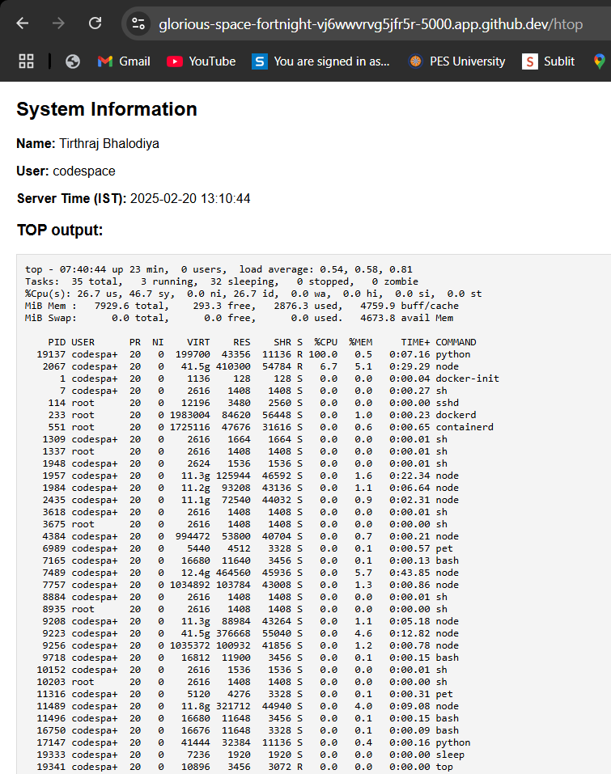

# 🚀 Flask HTOP System Info App

This is a simple **Flask application** hosted on **GitHub Codespaces** that provides real-time system information including:
- ✅ Your **Full Name**
- ✅ **System Username**
- ✅ **Server Time in IST**
- ✅ **Live `top` Command Output**

---

## 📌 **Demo**
  
*(Above image shows the actual output of the `/htop` endpoint.)*

---

## 📌 **How to Use**
1. Open the hosted **HTOP Endpoint**:  
   👉 [HTOP Live Link](https://glorious-space-fortnight-vj6wwwrvg5jfr5r-5000.app.github.dev/htop)
   
2. View real-time **system performance** and **server details**.

---

## 📌 **How to Run Locally**
### 🔹 **1️⃣ Clone the Repository**
```bash
git clone https://github.com/Tirthraj1605/flask-app.git
cd flask-app
